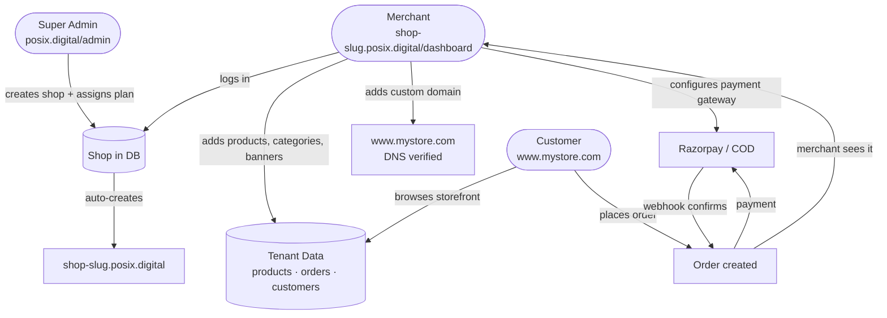

# Oak Commerce Backend Architecture

Single NestJS API serving all tenants on port **5001**. One Postgres database, all data isolated by `shop_id`.

---

## Who Uses What

```
Super Admin  (platform owner)
    │  manages shops, plans, subscriptions, team
    │  → /api/v1/platform/*
    │
    └── Merchant  (shop owner)
            │  manages products, orders, settings, domains
            │  → /api/v1/merchant/*
            │
            └── Customer  (end user)
                    │  browses storefront, places orders
                    │  → /api/v1/storefront/*  (public)
                    └── /api/v1/customer/*   (authenticated)
```

---

## Full Flow — Super Admin to End User



---

## Request Lifecycle

Every request hits `TenantMiddleware` first. Platform routes bypass it entirely.

```mermaid
flowchart TD
    REQ([Incoming Request]) --> CHECK{hostname?}

    CHECK -->|admin.* or api.*| BYPASS[bypass — no tenant needed]
    BYPASS --> PLATFORM[/api/v1/platform/*\nSuper Admin controllers]

    CHECK -->|shop domain or subdomain| LOOKUP[look up shop_id\nfrom shop_domains table]
    LOOKUP -->|not found on localhost| FALLBACK[fallback to testShop\ndev only]
    LOOKUP --> SUBCHECK{subscription\nstatus?}
    SUBCHECK -->|cancelled or expired| BLOCK[402 Payment Required]
    SUBCHECK -->|active or free| ALS[inject shopId into\nAsyncLocalStorage]

    ALS --> ROUTES{route prefix}
    ROUTES -->|/merchant/*| MC[Merchant Controllers\nshop-scoped]
    ROUTES -->|/storefront/*| SC[Storefront Controllers\npublic read]
    ROUTES -->|/customer/*| CC[Customer Controllers\ncustomer JWT]
    ROUTES -->|/payments/*| PC[Payment Controllers\nRazorpay]
```

---

## Directory Layout

| Path | Purpose |
| :--- | :--- |
| `prisma/central.prisma` | Platform-wide schema — shops, admins, subscriptions, domains |
| `prisma/tenant.prisma` | Per-shop schema — products, orders, customers, reviews |
| `src/common/middleware/tenant.middleware.ts` | Resolves `shopId` from hostname on every request |
| `src/modules/platform/` | `/api/v1/platform/*` — super-admin operations |
| `src/modules/merchant/` | `/api/v1/merchant/*` — shop owner operations |
| `src/modules/storefront/` | `/api/v1/storefront/*` — public storefront |
| `src/modules/customer/` | `/api/v1/customer/*` — customer auth and account |
| `src/modules/payment/` | `/api/v1/payments/*` — Razorpay integration |

---

## Database Layout

One database, two logical groups of tables.

```
PostgreSQL · oak_commerce
│
├── CENTRAL (PrismaService)          — platform-wide, no shop_id filter
│   ├── shops
│   ├── shop_domains                 — subdomain + custom domains per shop
│   ├── platform_admins
│   ├── tenant_requests
│   ├── subscription_plans           — Free / Starter / Pro / Enterprise
│   ├── shop_subscriptions           — which plan a shop is on
│   ├── subscription_payments        — payment history
│   ├── subscription_addons
│   ├── plan_addons
│   ├── shop_subscription_addons
│   └── promo_codes
│
└── TENANT (TenantPrismaService)     — all rows carry shop_id
    ├── products → product_variants
    ├── categories
    ├── orders → order_items
    ├── customers
    ├── reviews
    ├── banners
    ├── payment_gateways
    ├── blog_posts
    └── media_library
```

---

## Domain System

Every shop gets a platform subdomain automatically. Merchants can also add a custom domain with DNS verification.

```
Shop slug: nature-glow
│
├── Subdomain (auto, always active)
│   └── nature-glow.posix.digital
│
└── Custom domain (merchant adds, DNS verified)
    ├── Merchant adds: www.natureglow.com
    ├── Merchant adds TXT record: _oak-verify.www.natureglow.com
    ├── Merchant adds CNAME: www.natureglow.com → shops.posix.digital
    ├── Merchant hits POST /merchant/domains/:id/verify
    └── Status flips active → TenantMiddleware resolves it
```

In dev (`NODE_ENV=development`) DNS check is skipped — custom domains verify instantly.

---

## Prisma Schema Files

| File | Client path | Used by |
| :--- | :--- | :--- |
| `prisma/central.prisma` | `src/generated/central` | `PrismaService` |
| `prisma/tenant.prisma` | `src/generated/tenant` | `TenantPrismaService` |
| `prisma/schema.prisma` | — | Prisma Studio only |

```bash
# After any schema change:
pnpm db:push      # pushes both central + tenant to DB
pnpm db:generate  # regenerates both Prisma clients
```

---

## Development Guidelines

- Central queries (shops, subscriptions, admins): inject `PrismaService`
- Tenant queries (products, orders, customers): inject `TenantPrismaService`
- Never call `new PrismaClient()` directly in domain code
- Keep controllers thin — delegate all logic to services
- Platform routes have no `shopId` — never call `TenantPrismaService` from `PlatformService`

---

## Visual Overview

```
 ┌─────────────────────────────────────────────────────────────────────────┐
 │                         OAK COMMERCE PLATFORM                          │
 │                          posix.digital/admin                            │
 │                                                                         │
 │   SUPER ADMIN                                                           │
 │   ┌──────────────┐   creates shops    ┌──────────────────────────────┐  │
 │   │  Dashboard   │ ─────────────────► │  Shop A   │  Shop B  │ ...  │  │
 │   │  (port 3002) │   assigns plans    └──────────────────────────────┘  │
 │   └──────────────┘   manages team                                       │
 └─────────────────────────────────────────────────────────────────────────┘
                │
                │  /api/v1/platform/*
                ▼
 ┌─────────────────────────────────────────────────────────────────────────┐
 │                        NestJS API  (port 5001)                          │
 │                                                                         │
 │   ┌──────────────────────────────────────────────────────────────────┐  │
 │   │                      TenantMiddleware                            │  │
 │   │                                                                  │  │
 │   │   request hostname                                               │  │
 │   │        │                                                         │  │
 │   │        ├─► admin.*  ──────────────────────────► bypass          │  │
 │   │        │                                                         │  │
 │   │        ├─► shop-slug.posix.digital ─► resolve shopId            │  │
 │   │        │                                                         │  │
 │   │        ├─► www.custom-domain.com ──► resolve shopId (verified)  │  │
 │   │        │                                   │                     │  │
 │   │        └─► localhost (dev) ───────► testShop fallback           │  │
 │   │                                            │                     │  │
 │   │                             check subscription status            │  │
 │   │                             expired/cancelled ──► 402            │  │
 │   │                             active ──► inject shopId into ALS   │  │
 │   └──────────────────────────────────────────────────────────────────┘  │
 │                 │                    │                   │               │
 │   /platform/*   │   /merchant/*      │   /storefront/*   │ /customer/*   │
 │                 ▼                    ▼                   ▼               │
 │          PrismaService         TenantPrismaService (shopId scoped)       │
 └─────────────────────────────────────────────────────────────────────────┘
                │                              │
                ▼                              ▼
 ┌───────────────────────────┐   ┌─────────────────────────────────────────┐
 │   CENTRAL TABLES          │   │   TENANT TABLES  (all have shop_id)     │
 │                           │   │                                         │
 │   shops                   │   │   products ──► product_variants         │
 │   shop_domains             │   │   categories                           │
 │   platform_admins         │   │   orders ──► order_items               │
 │   subscription_plans      │   │   customers                            │
 │   shop_subscriptions      │   │   reviews                              │
 │   subscription_payments   │   │   banners                              │
 │   promo_codes             │   │   payment_gateways                     │
 │   subscription_addons     │   │   blog_posts                           │
 └───────────────────────────┘   └─────────────────────────────────────────┘
                │                              │
                └──────────────┬───────────────┘
                               ▼
                    PostgreSQL · oak_commerce
                        (single database)


 ┌─────────────────────────────────────────────────────────────────────────┐
 │  MERCHANT                    shop-slug.posix.digital/dashboard          │
 │  ┌────────────────┐                                                     │
 │  │   Dashboard    │  manages products, orders, settings, domains        │
 │  │   (port 3000)  │  configures Razorpay / COD                         │
 │  └────────────────┘                                                     │
 │         │  /api/v1/merchant/*                                           │
 └─────────│───────────────────────────────────────────────────────────────┘
           │
           ▼
 ┌─────────────────────────────────────────────────────────────────────────┐
 │  CUSTOMER                    www.custom-domain.com  (or subdomain)      │
 │  ┌────────────────┐                                                     │
 │  │   Storefront   │  browses products ──► adds to cart ──► checkout    │
 │  │   (port 3001)  │       │                                            │
 │  └────────────────┘       ▼                                            │
 │                      Razorpay / COD                                     │
 │                           │                                             │
 │                    order confirmed ──► merchant notified                │
 │         │  /api/v1/storefront/*  +  /api/v1/customer/*                 │
 └─────────────────────────────────────────────────────────────────────────┘
```
