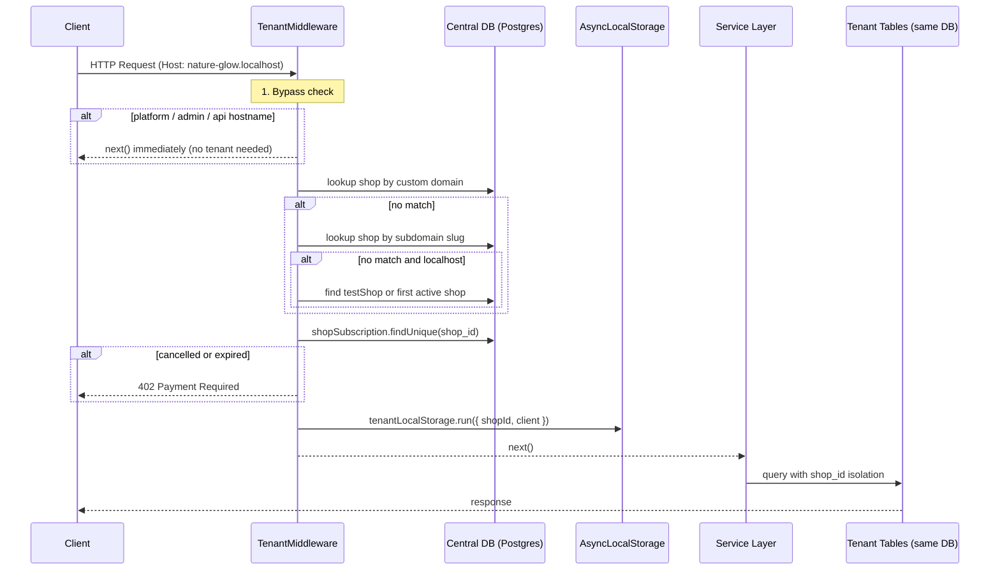
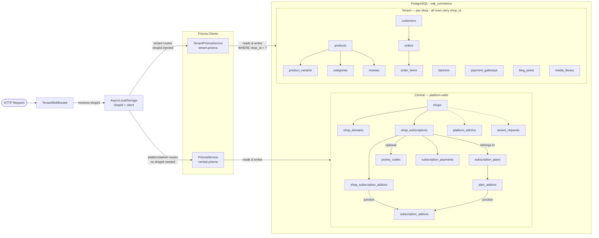
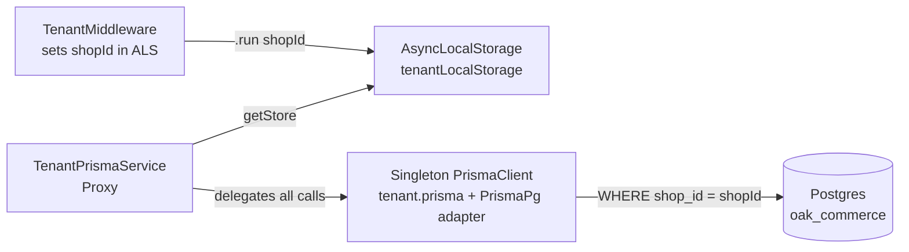
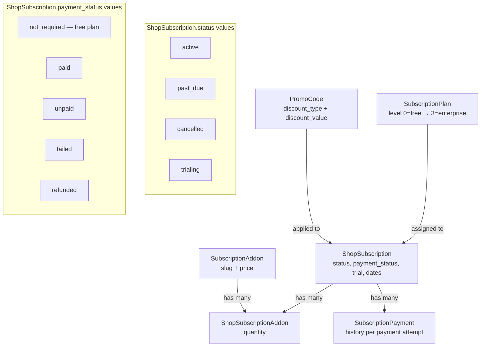

# Oak Commerce Backend Architecture

Single NestJS API serving all tenants on port **5001**. One Postgres database, all data isolated by `shop_id`.

---

## Directory Layout

| Path | Purpose |
| :--- | :--- |
| `prisma/` | Three schema files: `central.prisma`, `tenant.prisma`, `schema.prisma` (dev/studio) |
| `src/main.ts` | Entry point — CORS, global filters, port binding |
| `src/app.module.ts` | Root module wiring all feature modules and middleware |
| `src/common/middleware/tenant.middleware.ts` | Resolves `shopId` from hostname on every request |
| `src/common/utils/permissions.ts` | Platform admin permission checks |
| `src/database/` | Prisma services and tenant AsyncLocalStorage context |
| `src/modules/platform/` | `/api/v1/platform/*` — super-admin operations |
| `src/modules/merchant/` | `/api/v1/merchant/*` — shop owner operations |
| `src/modules/storefront/` | `/api/v1/storefront/*` — public customer-facing routes |
| `src/modules/customer/` | `/api/v1/customer/*` — customer auth and account |
| `src/modules/payment/` | `/api/v1/payments/*` — Razorpay integration |
| `test/` | E2E test suites |

---

## API Route Namespaces

| Prefix | Caller | Auth |
| :--- | :--- | :--- |
| `/api/v1/platform/*` | super-admin dashboard | super_admin JWT |
| `/api/v1/merchant/*` | merchant dashboard | merchant JWT |
| `/api/v1/storefront/*` | storefront (public) | none |
| `/api/v1/customer/*` | storefront (authenticated) | customer JWT |
| `/api/v1/payments/*` | storefront + merchant dashboard | varies |

---

## Request Lifecycle

Every incoming request passes through `TenantMiddleware` before reaching any controller.



---

## Database Architecture

One Postgres database (`oak_commerce`). All tenant data lives in the same schema, isolated by `shop_id` column. There is no per-shop database or schema switching.

### Mermaid Diagram



### ASCII Diagram

```
HTTP Request
     │
     ▼
┌─────────────────────────────────────────────────────────┐
│                    TenantMiddleware                     │
│                                                         │
│  hostname ──► custom domain lookup ──► shops table      │
│                      │                                  │
│                      ▼                                  │
│             subdomain slug lookup                       │
│                      │                                  │
│                      ▼                                  │
│          localhost fallback (dev only)                  │
│                      │                                  │
│                      ▼                                  │
│           subscription status check ──► 402 if expired  │
│                      │                                  │
│                      ▼                                  │
│         AsyncLocalStorage.run({ shopId })               │
└──────────────────────┬──────────────────────────────────┘
                       │
          ┌────────────┴────────────┐
          │                         │
          ▼                         ▼
 /platform/* routes        /merchant/* /storefront/*
 /api no shopId            /customer/* routes
          │                         │
          ▼                         ▼
  ┌──────────────┐         ┌──────────────────┐
  │ PrismaService│         │TenantPrismaService│
  │ central.prisma│        │ tenant.prisma     │
  └──────┬───────┘         └────────┬─────────┘
         │                          │
         ▼                          ▼
┌────────────────────┐   ┌──────────────────────────────┐
│   CENTRAL TABLES   │   │       TENANT TABLES          │
│                    │   │   (all filtered by shop_id)  │
│  shops             │   │                              │
│  shop_domains      │   │  products                    │
│  platform_admins   │   │  product_variants            │
│  tenant_requests   │   │  categories                  │
│                    │   │  orders ──► order_items       │
│  subscription_plans│   │  customers                   │
│      │             │   │  reviews                     │
│      ▼             │   │  banners                     │
│  shop_subscriptions│   │  payment_gateways            │
│      │    │    │   │   │  blog_posts                  │
│      │    │    │   │   │  media_library               │
│      ▼    ▼    ▼   │   └──────────────────────────────┘
│  payments addons   │
│  promo_codes       │
│  plan_addons       │
└────────────────────┘
         │                          │
         └────────────┬─────────────┘
                      ▼
            PostgreSQL · oak_commerce
              (single database)
```

---

## Tenant Isolation

`TenantPrismaService` is a Proxy that reads the current `shopId` from `AsyncLocalStorage` on every method call. Services never pass `shopId` manually — it flows automatically from the middleware context.



---

## Subscription System

Merchants pay the platform for access. This is entirely separate from customer-to-merchant payments (Razorpay).



---

## Prisma Schema Files

| File | Generated client path | Used by |
| :--- | :--- | :--- |
| `prisma/central.prisma` | `src/generated/central` | `PrismaService` — shops, admins, subscriptions |
| `prisma/tenant.prisma` | `src/generated/tenant` | `TenantPrismaService` — products, orders, customers |
| `prisma/schema.prisma` | — | Prisma Studio / dev inspection only |

Regenerate clients after schema changes:
```bash
npx prisma generate --schema=prisma/central.prisma
npx prisma generate --schema=prisma/tenant.prisma

# Apply schema changes to the database:
npx prisma db push --schema=prisma/central.prisma
npx prisma db push --schema=prisma/tenant.prisma
```

---

## Development Guidelines

- Never call `new PrismaClient()` in domain code — always inject `PrismaService` or `TenantPrismaService`.
- Central queries (shops, subscriptions, admins): inject `PrismaService`.
- Tenant queries (products, orders, customers): inject `TenantPrismaService`.
- Keep controllers thin — one method per route, all logic in the service.
- Platform routes bypass `TenantMiddleware` (hostname `admin.*` or `api.*`) — they have no `shopId`.
