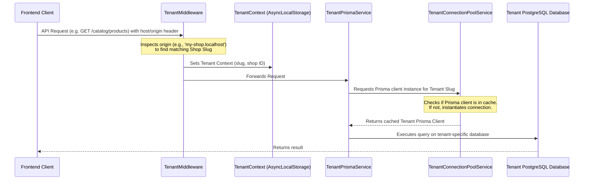

# Oak Commerce Backend Architecture Guide 🏗

Welcome to the backend architecture guide of **Oak Commerce**. This document explains the folder layout, core design decisions, and how our multi-tenant architecture works under the hood.

---

## 📂 Directory Layout

Here is a quick breakdown of where files are located and what they do:

| Directory/File | Purpose |
| :--- | :--- |
| **`prisma/`** | Contains database schemas: central vs. tenant-specific schemas, and migrations. |
| **`scripts/`** | Independent utility scripts (e.g. database seeding, test connections, maintenance). |
| **`src/`** | The main application source code directory. |
| **`src/main.ts`** | Application entry point (initializes NestJS, registers CORS, global filters). |
| **`src/app.module.ts`** | Root application module linking feature modules and middlewares. |
| **`src/common/`** | Universally shared tools, filters, middlewares, and types. |
| **`src/database/`** | Prisma services and multi-tenant connection pool manager. |
| **`src/modules/`** | Domain-specific feature modules containing controllers, services, and business logic. |
| **`test/`** | E2E (End-to-End) testing suites and Jest configuration. |

---

## 🏢 Multi-Tenant Flow

Oak Commerce is a multi-tenant platform. This means a single running instance of our server serves multiple merchant storefronts, and each storefront uses its own separated tenant database for security and performance.

Here is how a client request is handled:



### 1. Tenant Identification (`src/common/middleware/tenant.middleware.ts`)
* Every incoming request runs through the `TenantMiddleware`.
* It inspects the `x-tenant-slug` header, `origin`, or query parameters to identify which shop (tenant) is making the request.
* It saves the resolved tenant information in `TenantContext`.

### 2. Tenant Context (`src/database/tenant-context.ts`)
* Uses NodeJS's `AsyncLocalStorage` to store the current request's tenant context.
* This allows any service during the request lifecycle to get the current tenant details without passing them manually.

### 3. Dynamic Connection Pooling (`src/database/tenant-connection-pool.service.ts`)
* Generates and caches `PrismaClient` instances dynamically for each tenant.
* If a client for `tenant-a` is already created, it returns the cached instance (extremely fast, avoids open-connection overhead).
* Automatically closes inactive connections to conserve database resources.

---

## 🗄 Prisma Schema Breakdown

We split our database schemas in `prisma/` for clarity and modularity:

1. **`schema.prisma`** (Canonical/Dev Schema):
   * Used for visual database inspection in Prisma Studio and running central migrations.
   * Defines both central entities (e.g., `Shop`, `TenantRequest`) and tenant entities.

2. **`central.prisma`**:
   * Generates typings exclusively for the platform-level tables (e.g. tracking shop subscriptions, domains, and global admin roles).

3. **`tenant.prisma`**:
   * Generates typings for tenant-specific operational tables (e.g. `Product`, `Order`, `Category`, `Review`).

---

## ⚙️ Development Guidelines

1. **Keep Modules Isolated**:
   * Add new endpoints inside `src/modules/<feature>`.
   * Keep controllers lightweight; delegate database/business operations to services.

2. **Always inject Prisma**:
   * Never instantiate `new PrismaClient()` directly in your domain code.
   * For tenant-specific queries, inject `TenantPrismaService`:
     ```typescript
     constructor(private readonly prisma: TenantPrismaService) {}
     ```
   * For central queries, inject `PrismaService`:
     ```typescript
     constructor(private readonly prisma: PrismaService) {}
     ```
